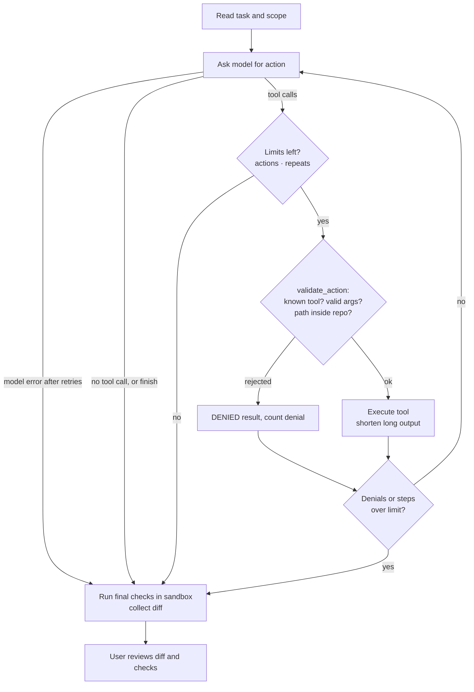

# coding-harness

| | |
|---|---|
| Lecture | Advanced AI-Assisted Software Development (AAIA) |
| Semester | Wintersemester 2026, MSE3 |
| Deliverable | Stage 1: Working POC |
| Author | Michael Auß, se25m055@technikum-wien.at |

A small coding harness in Python (Stage 1 of the AAIA semester project). A coding task goes in.
A local model works on a disposable copy of the target repository through validated tools, and
the harness then runs the final checks itself. The user reviews the diff and the check results.

## Setup

Requirements: macOS, Linux or Windows, [uv](https://docs.astral.sh/uv/), [Ollama](https://ollama.com),
Podman (or Docker, via `engine = "docker"`), git.

```bash
uv sync                                   # Python 3.13 and dependencies
ollama pull qwen3.8:27b                   # the model in harness.example.toml
git clone https://github.com/cosmicpython/code code && git -C code checkout 14c84797ffa77255d53cf1a02fe6aafda2b68aeb
podman build -f sandbox/cosmic-python.Containerfile -t harness-cosmic-python code
cp harness.example.toml harness.toml      # no secrets needed
```

### Windows

Runs natively in PowerShell; WSL is only used internally by `podman machine`. Start the Podman
machine first (`podman machine start`), then:

```powershell
uv sync
ollama pull qwen3.8:27b
git clone https://github.com/cosmicpython/code code; git -C code checkout 14c84797ffa77255d53cf1a02fe6aafda2b68aeb
podman build --network host -f sandbox/cosmic-python.Containerfile -t harness-cosmic-python code
Copy-Item harness.example.toml harness.toml
```

`--network host` is needed because the Podman machine cannot set up build networking
(netavark/nftables error). It applies to the build only; checks still run with `--network none`.

| Problem | Fix |
|---|---|
| `uv` not found after `pip install --user uv` | Add `%APPDATA%\Python\Python313\Scripts` to `PATH`, or `winget install astral-sh.uv` |
| `ollama ps`: "timed out waiting for server to start"; `server.log`: `bind: ... forbidden` | Hyper-V/WSL reserved a port range containing 11434 (`netsh int ipv4 show excludedportrange protocol=tcp`). In an admin terminal: `net stop winnat`, `netsh int ipv4 add excludedportrange protocol=tcp startport=11434 numberofports=1`, `net start winnat`; then restart Ollama |
| `invalid peer certificate: UnknownIssuer` (uv) or `unable to get local issuer certificate` (git) | Antivirus or a proxy re-signs HTTPS. Use the Windows certificate store: `uv --system-certs ...` and `git config --global http.sslBackend schannel` |

The harness itself handles two Windows differences: the workspace is cloned with
`core.autocrlf=false`, so files keep their LF line endings and the model's edits match, and a
timed-out command's process tree is killed with `taskkill /T` instead of a process-group signal.

## Usage

```bash
uv run coding-harness baseline                    # final checks on the untouched starting commit
uv run coding-harness run --task "Fix ..."        # or --task-file tasks/<name>.md; --model to override
uv run coding-harness run --review-model qwen3.8:27b --task-file ...  # with a second-model review
uv run pytest                                     # harness tests: no model, no container needed
```

`run` prints each model step and tool request, then the changed files, the diff and a table
of final checks, plus token usage. It exits with 0 only if an acceptance check is configured and
every final check passed. Each run keeps under `.harness/runs/<id>/`:

- `repo/`: the repository copy with the agent's change
- `events.jsonl`: every event, appended as it happens, so it survives a crash mid-run
- `trace.json`: the summary written at the end (messages, commands, exit codes, checks, diff)

## Components


| Module | Responsibility |
|---|---|
| `cli.py` | Commands `run` and `baseline`. Shows progress, changed files, diff, check table and token usage. Rejects empty or one-word tasks. |
| `harness.py` | Wires one run: workspace, tools, two sandboxes (agent without, verification with the acceptance check), controller. Writes `events.jsonl` and `trace.json`. |
| `config.py` | Loads `harness.toml` and validates it with Pydantic; unknown keys and wrong types are errors. |
| `controller.py` | Loop: ask the model → validate → execute → return the result. Enforces step, action, denial, repeat and retry limits. |
| `toolset.py` | Tool descriptions and Pydantic argument schemas. Rejects unknown tools and invalid arguments before execution. |
| `tools.py` | File tools confined to the repository copy (resolves symlinks, blocks `..`, absolute paths and `.git`). Edit guardrails: rejects syntax errors, new undefined names and edits that change nothing; repairs indentation when that is the only way to keep the file valid. |
| `sandbox.py` / `process.py` | Runs configured commands in a container. Timeout, bounded output, and removal of the process group and container. |
| `workspace.py` | Fresh clone at the configured commit with no remote. Diff and changed files. |
| `verification.py` | Final checks, run whatever the model claims. Failed or unavailable checks stay visible. Optional `lint` check of kind `quality`. |
| `lint.py` | pyflakes plus pycodestyle E402 (code before an import). Compares with the starting commit and counts only problems the change introduces. Static: the code is never run. |
| `review.py` | Optional second-model review of the diff after `finish`. The reviewer sees task, scope and diff, never the agent's own summary, and answers with a JSON verdict. |
| `model_client.py` | Provider-neutral `ModelClient` protocol. Ollama client with a fallback for tool calls written as text. Scripted client for tests. |
| `prompts.py` | System prompt and the first user message (task, scope, available checks). |
| `domain.py` | Shared data types: `ToolCall`, `ModelResponse`, `ToolResult`, `CommandResult`, `StopReason`, `RunStats`, `Event`. |
| `output.py` | Shortens long text to head and tail with a visible marker. |

## Agent loop



Every stop has a reason (`StopReason`): `completed`, `step_limit`, `action_limit`, `denied_limit`,
`repeat_limit`, `model_error` or `interrupted` (Ctrl+C). The final checks run in every case.

**Review (optional).** If `[review]` is enabled and the agent stopped with `completed` and a
non-empty diff, a second model reviews the diff. If it requests changes, its findings go back to
the agent as a new message in the same conversation, at most `max_rounds` times. The agent keeps
its step and action budget; it is not reset. The final diff is reviewed once more and the
verdict is shown and kept in `trace.json`. The review is advisory: the reviewer is a model too,
so only the final checks decide VERIFIED.

## Configuration

`harness.toml` (copied from `harness.example.toml`, relative paths are relative to the file):

| Section | Purpose |
|---|---|
| `[model]` | Provider, model name, host, temperature, optional `context_window` (Ollama `num_ctx`) |
| `[target]` | Target repository, exact starting commit, and the `scope` shown to the model (what may change) |
| `[limits]` | Steps, actions, denials, identical repeats, model retries, tool output size |
| `[sandbox]` | Container engine and image, network, memory, CPUs, PIDs, timeout, output limit |
| `[checks]` | Commands the agent may run by name with `run_check` |
| `[verification]` | Acceptance checks (hidden from the agent) and regression checks run after every run; `lint = true` adds the lint check |
| `[review]` | `enabled`, `max_rounds` and `[review.model]` for the reviewer (default: same as `[model]`). `--review-model` / `--no-review` override it |

The task itself is not configuration: it comes from `--task` or `--task-file`.

## Safety measures

- **Disposable copy.** Each run clones the target into `.harness/runs/<id>/repo` and removes the
  `origin` remote. The harness has no push, merge or deploy tool. Git runs with hooks and
  fsmonitor disabled.
- **Scoped file tools.** Paths are resolved (including symlinks) and must stay inside the copy.
  `.git` is off limits and writes are size-limited.
- **Contained execution.** The model can only run named checks from `[checks]`, never a free
  shell command. Each check runs in a new container with no network, all capabilities dropped,
  `no-new-privileges`, memory, CPU and PID limits, a read-only root filesystem, and the
  repository copy mounted read-only. No home directory or credentials are mounted.
- **Edit guardrails.** Following the linting guardrail in the SWE-agent paper, an edit or write
  to a Python file is checked before anything is written. The code is only analysed, never run.
  - A new syntax error (`ast.parse`) or a new undefined name (pyflakes, like flake8 F821) rejects
    the change. The model gets the error and the numbered lines as the file would have looked.
  - Only problems the change introduces count; an already broken file can still be edited.
  - An edit whose `new_text` equals `old_text` is rejected as a no-op.
  - Indentation repair: if `old_text` starts after a line's indentation and the later lines of
    `new_text` lack it, they are indented to match, but only when the result is valid Python.
    If `old_text` is not found exactly, whole lines may match ignoring indentation. The model
    is told when either happened. A correct edit is applied exactly as sent.
- **Stoppable.** Commands run in their own process group. On timeout or Ctrl+C the group is
  killed (on Windows: the process tree, with `taskkill /T`) and the container is removed with
  `podman rm --force`.
- **Hidden acceptance check.** `acceptance/` is outside the agent's copy and is mounted read-only
  only for the final verification.
- **Untrusted input.** Model replies, file contents and command output are treated as data. Every
  tool request is validated in application code. The reviewer is untrusted too: it has no tools,
  its findings reach the agent only as a message, and it cannot change the verification result.

## Tests

Core tests use scripted model replies and a fake execution environment, so no model, API key or
container is needed.

| Handout requirement | Tests |
|---|---|
| File tools | `tests/test_file_tools.py` |
| Controller | `tests/test_controller.py` |
| Invalid request | `tests/test_invalid_requests.py` |
| Failed command | `tests/test_process.py`, `tests/test_verification.py` |
| Action limit | `tests/test_limits.py::test_repeating_reply_reaches_action_limit` |
| Output limit | `tests/test_limits.py`, `tests/test_process.py` |
| Stoppable command | `tests/test_process.py::test_timeout_kills_the_whole_process_group`, `tests/test_sandbox.py` |
| Bug fix | `acceptance/test_invalid_quantity.py` (final verification, against the real target) |
| Edit guardrail (extra) | `tests/test_file_tools.py::test_edit_that_breaks_python_syntax_is_rejected` and the three tests after it |
| Lint check, new problems only (extra) | `tests/test_lint.py` |
| Second-model review (extra) | `tests/test_review.py` |
| Indentation repair, undefined names, no-op edits (extra) | `tests/test_file_tools.py`, from `test_edit_inserted_mid_line_gets_the_lines_indentation` to the end; each reproduces a qwen2.5-coder:7b failure |
| Crash-safe event log (extra) | `tests/test_verification.py::test_events_are_logged_as_they_happen_and_survive_a_crash` |
| LF line endings on Windows (extra) | `tests/test_workspace.py::test_clone_keeps_lf_line_endings_even_with_autocrlf` |

## Stage 1 task

- **Target:** [cosmicpython/code](https://github.com/cosmicpython/code) at commit `14c84797ffa77255d53cf1a02fe6aafda2b68aeb`
- **Bug:** allocating an order line with a quantity of zero or less is accepted. A negative
  quantity even *increases* the batch's available stock (10 → 15 for −5) and publishes an
  `Allocated` event. The path runs `commands.Allocate` → message bus → `handlers.allocate` →
  `model.Product` / `model.Batch`.
- **Task:** [`tasks/invalid-quantity.md`](tasks/invalid-quantity.md). The task names the
  exception `handlers.InvalidQuantity`, because the acceptance check depends on that interface.
- **Allowed scope:** `service_layer/handlers.py` and, if needed, `domain/model.py`. Existing tests
  must not change.
- **Acceptance check:** [`acceptance/test_invalid_quantity.py`](acceptance/test_invalid_quantity.py).
  On the starting commit, `baseline` reports 2 failed and 1 passed. A reference fix (checked in a
  throwaway copy, not in the repository) gives 3 passed, and the 20 existing unit tests still pass.
- **Manual help during the agent run:** none.

Runs with qwen3.8:27b (traces are kept locally under `.harness/runs/`):

| Run | Task given | Result |
|---|---|---|
| `20260927-214256`, `20260927-215753`, `20260928-202511` | `tasks/invalid-quantity.md` | VERIFIED: the same 6-line fix each time, 5 model calls, 7 actions, 0 denied. The last run used 11,564 prompt tokens in total; the largest prompt was 2,852 tokens. |
| `20260927-214641` | only the word "invalid-quantity.md" (a usage error) | NOT VERIFIED: the model guessed `qty < 0`, claimed success, and the acceptance check failed for `qty = 0`. The CLI now rejects one-word tasks. |
| `20261004-215614` | `tasks/invalid-quantity.md`, on Windows | VERIFIED: 4 model calls, 7 actions, 0 denied, 8,897 prompt tokens. Same result before and after the edit guardrail changes below. |

Runs with qwen2.5-coder:7b (`--model qwen2.5-coder:7b`, Windows), before and after adding the
indentation repair, undefined-name check, numbered rejection context and no-op check:

| Harness | Verified | What happened |
|---|---|---|
| Before (`20261004-213903`, `-213950`, `-214016`) | 0 / 3 | Run 1: raised `InvalidQuantity` without defining it, the unit tests still passed, and the model claimed success; only the acceptance check caught it. Runs 2 and 3: sent the same unindented edit 5 times, rejected by the syntax guardrail each time, then `repeat_limit`. |
| After (`20261004-215420`, `-215502`, `-215542`) | 2 / 3 | The no-op and undefined-name checks rejected its first edits; it then defined the exception and the check. 11–12 model calls, about 33,000 prompt tokens, one denied call to a nonexistent `commit` tool. The failed run put an `import` inside the function and hit `repeat_limit`. |

The two verified 7B fixes pass every check but are not clean: the class sits between the imports
and `line = OrderLine(...)` is duplicated. The checks prove the behaviour, not the code quality,
so the diff review stays necessary.

Then the lint check and the review were added, and qwen2.5-coder:7b ran with `lint = true` and
`--review-model qwen3.8:27b`:

| Harness | Verified | What happened |
|---|---|---|
| Lint + review (`20261004-220809`, `-220847`, `-222010`) | 0 / 3 | Two runs hit `repeat_limit` before finishing, so there was nothing to review. In the third, the acceptance check **passed**, but lint failed with 17 new problems (duplicated imports, E402). Before the lint check, this run would have been VERIFIED. The reviewer named every problem correctly, including the duplicated `line = OrderLine(...)` that lint cannot see. The 7B model fixed only part of it in its one round. This run also showed two weaknesses, both fixed since: lint warnings compared only with the previous edit, so a worsened problem went quiet, and the agent could not run lint itself. |
| Same, after both fixes (`20261004-222701`, `-222743`, `-222825`) | 0 / 3 | None reached `finish`, so none was reviewed: `model_error` (Ollama aborted the 7B model for repeating tokens), `repeat_limit`, `denied_limit` (5 edits with an empty `old_text`). |
| qwen3.8:27b with lint (`20261004-222052`, `-222903`) | 2 / 2 | Lint passed; same fix and numbers as without lint. |

So the lint check and the review stop a sloppy 7B fix from counting as VERIFIED. They do not
make the 7B model produce a clean one. Review costs time: with Ollama swapping between the 7B
and 27B models, the reviewed run took about 12 minutes.

```bash
uv run coding-harness baseline                                  # acceptance check fails
uv run coding-harness run --task-file tasks/invalid-quantity.md # agent fixes it; checks pass
```

## Known limitations

- **The HTTP API still answers 500.** The verified fix makes the handler raise `InvalidQuantity`,
  but `entrypoints/flask_app.py` only maps `InvalidSku` to 400, so `POST /allocate` with
  `qty <= 0` returns 500. The acceptance check goes through the message bus and does not cover the
  API. A check proves only what it tests.
- **Regression coverage.** Only the 20 unit tests run as regression checks. Six integration tests
  would also run offline (SQLite); two need Postgres or Mailhog.
- **One task.** The evidence is one task with a few runs on two models, not a success rate over
  several tasks. Three runs per setting are too few to tell 2/3 from a lucky streak.
- **Guardrails use the harness's Python.** `ast.parse` and pyflakes check with Python 3.13
  grammar and builtins, while the target runs on Python 3.9. Syntax or builtins that are new in
  3.10+ pass the guardrails and are caught by the tests instead.
- **Environment not fully pinned.** The base image `python:3.9-slim` and the target's
  `requirements.txt` are not version-locked, so a later image build may differ.
- **Weaker process cleanup on Windows.** Windows has no process groups to signal, so
  `taskkill /T` kills the process tree instead. A child that outlives its parent is no longer
  part of that tree and is not killed. Containers are still removed with `podman rm --force`
  on timeout.
- **Windows tested on one machine.** Windows 11 with Podman (WSL machine) and Ollama. The image
  build needs `--network host` there (see [Windows](#windows)).
