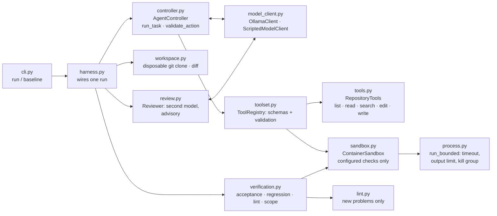
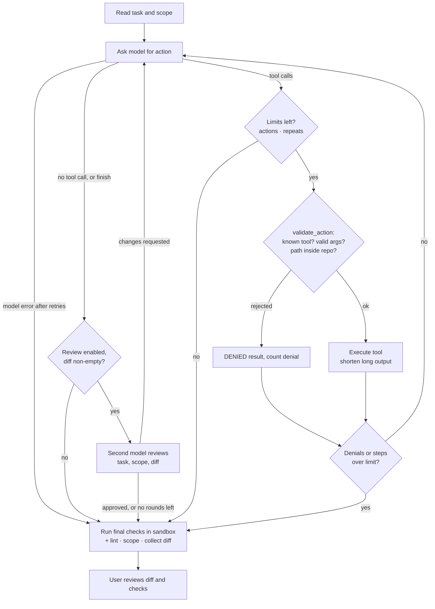

# coding-harness

| | |
|---|---|
| Lecture | Advanced AI-Assisted Software Development (AAIA) |
| Semester | Wintersemester 2026, MSE3 |
| Deliverable | Stage 1: Working POC |
| Author | Michael Auß, se25m055@technikum-wien.at |

A small coding harness in Python. A coding task goes in. A local model works on a disposable
copy of the target repository through validated tools, and the harness then runs the final
checks itself. The user reviews the diff and the check results.

## Setup

Requirements: macOS, Linux or Windows, [uv](https://docs.astral.sh/uv/), [Ollama](https://ollama.com),
Podman (or Docker, via `engine = "docker"`), git. On Windows, see [docs/windows.md](docs/windows.md).

```bash
uv sync                                   # Python 3.13 and dependencies
ollama pull qwen3.8:27b                   # the model in harness.example.toml
git clone https://github.com/cosmicpython/code code && git -C code checkout 14c84797ffa77255d53cf1a02fe6aafda2b68aeb
podman build -f sandbox/cosmic-python.Containerfile -t harness-cosmic-python code
cp harness.example.toml harness.toml      # no secrets needed
```

## Usage

```bash
uv run coding-harness baseline                                  # final checks on the untouched starting commit
uv run coding-harness run --task-file tasks/invalid-quantity.md # the Stage 1 task
uv run coding-harness run --task "Reject ..." --model <name>    # any task in words, another model
uv run coding-harness --help                                    # all options, examples, exit codes
uv run pytest                                                   # harness tests: no model, no container needed
```

`run` prints each model step and tool request, then the changed files, the diff, a table of
final checks and token usage. It exits with 0 only if an acceptance check is configured and every
final check passed. Each run keeps `repo/` (the changed copy), `events.jsonl` (every event, written
as it happens) and `trace.json` (the summary) under `.harness/runs/<id>/`.

## Components



| Module | Responsibility |
|---|---|
| `cli.py` | `run` and `baseline`: progress, changed files, diff, check table, token usage |
| `harness.py` | One run: workspace, tools, agent sandbox (no acceptance check), verification sandbox, trace |
| `config.py` | Loads `harness.toml` and validates it with Pydantic; unknown keys are errors |
| `controller.py` | Ask the model → validate → execute → return the result; step, action, denial, repeat and retry limits |
| `toolset.py` | Tool descriptions and argument schemas; rejects unknown tools and invalid arguments |
| `tools.py` | File tools confined to the repository copy, with edit guardrails |
| `sandbox.py`, `process.py` | Configured commands in a container; timeout, bounded output, cleanup |
| `workspace.py` | Fresh clone at the configured commit, no remote; diff and changed files |
| `verification.py` | Final checks, whatever the model claims; failed or unavailable checks stay visible |
| `model_client.py` | `ModelClient` protocol, Ollama client (with a fallback for tool calls written as text), scripted client for tests |
| `lint.py`, `review.py` | Optional extras, see [docs/guardrails.md](docs/guardrails.md) |

## Agent loop



Every stop has a reason (`StopReason`): `completed`, `step_limit`, `action_limit`, `denied_limit`,
`repeat_limit`, `model_error` or `interrupted` (Ctrl+C). The final checks run in every case.
Repeats are detected over the whole run, not just consecutively; the review is optional and off
by default. Both are described in [docs/guardrails.md](docs/guardrails.md).

## Configuration

`harness.toml` (copied from `harness.example.toml`; relative paths are relative to the file):

| Section | Purpose |
|---|---|
| `[model]` | Provider, model name, host, temperature, optional `context_window` |
| `[target]` | Target repository, exact starting commit, the `scope` shown to the model, and `allowed_paths` (globs) that the file tools and a final check enforce |
| `[limits]` | Steps, actions, denials, repeats, model retries, tool output size |
| `[sandbox]` | Container engine and image, network, memory, CPUs, PIDs, timeout, output limit |
| `[checks]` | Commands the agent may run by name with `run_check` |
| `[verification]` | Acceptance checks (hidden from the agent), regression checks, `lint` |
| `[review]` | Optional second-model review (`enabled`, `max_rounds`, `[review.model]`) |

The task itself is not configuration: it comes from `--task` or `--task-file`.

## Safety measures

- **Disposable copy.** Each run clones the target into `.harness/runs/<id>/repo` and removes the
  `origin` remote. There is no push, merge or deploy tool. Git runs with hooks and fsmonitor off.
- **Scoped file tools.** Paths are resolved (including symlinks) and must stay inside the copy.
  `.git` is off limits and writes are size-limited.
- **Contained execution.** The model can only run named checks from `[checks]`, never a free
  shell command. Each check runs in a new container with no network, all capabilities dropped,
  `no-new-privileges`, memory, CPU and PID limits, a read-only root filesystem, and the
  repository copy mounted read-only. No home directory or credentials are mounted.
- **Enforced scope.** `allowed_paths` limits writes to the listed files. The file tools deny any
  other write (reads stay open), and a final `scope` check fails if any other file changed, so
  existing tests cannot be weakened. The scope text in the task is only advice; this is the boundary.
- **Edit guardrails.** An edit that introduces a Python syntax error or an undefined name is
  rejected before anything is written. The code is only parsed, never run.
- **Stoppable.** Commands run in their own process group. On timeout or Ctrl+C the group is
  killed (on Windows: the process tree) and the container is removed with `podman rm --force`.
- **Hidden acceptance check.** `acceptance/` is outside the agent's copy and is mounted read-only
  only for the final verification.
- **Untrusted input.** Model replies, file contents and command output are treated as data. Every
  tool request is validated in application code.

## Tests

Core tests use scripted model replies and a fake execution environment, so no model, API key or
container is needed.

| Handout requirement | Tests |
|---|---|
| File tools (incl. allowed scope) | `tests/test_file_tools.py` |
| Controller | `tests/test_controller.py` |
| Invalid request | `tests/test_invalid_requests.py` |
| Failed command | `tests/test_process.py`, `tests/test_verification.py` |
| Action limit | `tests/test_limits.py::test_repeating_reply_reaches_action_limit` |
| Output limit | `tests/test_limits.py`, `tests/test_process.py` |
| Stoppable command | `tests/test_process.py::test_timeout_kills_the_whole_process_group`, `tests/test_sandbox.py` |
| Bug fix | `acceptance/test_invalid_quantity.py` (final verification, against the real target) |

Tests for the extras (guardrails, lint, loop detection, review, Windows line endings) are listed
in [docs/guardrails.md](docs/guardrails.md) and [docs/windows.md](docs/windows.md). The event log
surviving a crash: `tests/test_verification.py::test_events_are_logged_as_they_happen_and_survive_a_crash`.

## Stage 1 task

- **Target:** [cosmicpython/code](https://github.com/cosmicpython/code) at commit `14c84797ffa77255d53cf1a02fe6aafda2b68aeb`
- **Bug:** allocating an order line with a quantity of zero or less is accepted. A negative
  quantity even *increases* the batch's available stock (10 → 15 for −5) and publishes an
  `Allocated` event, and `POST /allocate` answers 202 (or 500 once something raises). The path runs
  `flask_app` → `commands.Allocate` → message bus → `handlers.allocate` → `model.Product` / `model.Batch`.
- **Task:** [`tasks/invalid-quantity.md`](tasks/invalid-quantity.md). The task does not name a
  solution or an exception type. It asks for a rejection from the allocation flow with unchanged
  stock, and for status 400 with a JSON `message` from `POST /allocate`, as for an unknown SKU.
- **Allowed scope:** `service_layer/handlers.py`, `entrypoints/flask_app.py` and, if needed,
  `domain/model.py`, enforced by
  `allowed_paths` (file tools and final `scope` check). Existing tests must not change.
- **Acceptance check:** [`acceptance/invalid-quantity/`](acceptance/invalid-quantity/test_invalid_quantity.py) (shared fakes in `acceptance/conftest.py`).
  It checks two levels on in-memory fakes: the message bus (any exception, stock unchanged) and
  the real Flask app through its test client (400, a JSON `message`, stock unchanged). On the
  starting commit, `baseline` reports 4 failed and 2 passed (the two positive-quantity tests).
  After the agent's change all 6 pass and the 20 existing unit tests still pass.
- **Manual help during the agent run:** none.

Runs with qwen3.8:27b (traces are kept locally under `.harness/runs/`):

| Run | Task given | Result |
|---|---|---|
| `20260927-214256`, `20260927-215753`, `20260928-202511` | earlier version of `tasks/invalid-quantity.md` (bus only, named `handlers.InvalidQuantity`) | VERIFIED: the same 6-line fix each time, 5 model calls, 7 actions, 0 denied, 11,564 prompt tokens in the last run |
| `20260927-214641` | only the word "invalid-quantity.md" (a usage error) | NOT VERIFIED: the model guessed `qty < 0`, claimed success, and the acceptance check failed for `qty = 0`. The CLI now rejects one-word tasks. |
| `20261004-222903` | earlier version of the task, Windows, final harness with lint | VERIFIED: acceptance, the 20 unit tests and lint pass; 4 model calls, 7 actions, 0 denied, 8,934 prompt tokens |
| `20261006-182952` | current `tasks/invalid-quantity.md` (no exception name, API must answer 400), `allowed_paths` enforced | VERIFIED: acceptance (6 tests), the 20 unit tests, lint and scope pass; changed `handlers.py` and `flask_app.py`; 6 model calls, 11 actions, 0 denied |

### Second task: negative batch quantity

A second, similar task shows that the harness is not tuned to one bug: creating a stock batch
with a negative quantity is accepted. [`tasks/negative-batch.md`](tasks/negative-batch.md) asks to
reject it and to answer `POST /add_batch` with 400 and a `message`. Its acceptance check is
[`acceptance/negative-batch/`](acceptance/negative-batch/test_negative_batch.py) and its settings
are in `harness.negative-batch.toml`: the same as `harness.example.toml`, with another acceptance
directory.

```bash
uv run coding-harness baseline -c harness.negative-batch.toml                                  # 2 failed, 3 passed
uv run coding-harness run -c harness.negative-batch.toml --task-file tasks/negative-batch.md   # VERIFIED
```

| Run | Result |
|---|---|
| `20261006-183355-d5e9a1` (qwen3.8:27b) | VERIFIED: acceptance (5 tests), the 20 unit tests, lint and scope pass; changed `handlers.py` and `flask_app.py`; 8 model calls, 13 actions, 0 denied |

Runs with the smaller qwen2.5-coder:7b, and the harness changes they led to, are in
[docs/experiments.md](docs/experiments.md).

### Reproduce the results

After [Setup](#setup), with Ollama and the Podman machine running:

```bash
uv run pytest                                                   # 1. 124 passed; no model or container needed
uv run coding-harness baseline                                  # 2. the bug is reproduced
uv run coding-harness run --task-file tasks/invalid-quantity.md # 3. the agent fixes it
```

| Step | Expected result |
|---|---|
| 1. `pytest` | `124 passed` |
| 2. `baseline` | `acceptance` **failed** (4 failed, 2 passed), `unit_tests`, `lint` and `scope` passed, `NOT VERIFIED` |
| 3. `run` | Steps such as `read_file` and `edit_file` on `handlers.py` and `flask_app.py`, then a diff that rejects `qty <= 0` in `allocate` with an exception and maps it to a 400 response in `allocate_endpoint`. `acceptance`, `unit_tests`, `lint` and `scope` passed, `VERIFIED`, exit code 0 |

qwen3.8:27b needs about 17 GB of RAM or VRAM; with it, step 3 took 1–3 minutes on the test
machine (a cold model load adds time). The model runs at temperature 0, but the exact steps and
wording of the diff can still vary between runs and machines; the checks are what should match.
The run IDs above refer to traces on the author's machine and are not in the repository; each
of your runs writes its own trace under `.harness/runs/<id>/`, and its path is printed at the end.

## Known limitations

- **The API check uses fakes.** The Flask test uses the real app but an in-memory repository, so
  it does not cover Postgres, Redis or the `e2e` tests. A check proves only what it tests.
- **Regression coverage.** Only the 20 unit tests run as regression checks. Six integration tests
  would also run offline (SQLite); two need Postgres or Mailhog.
- **Two tasks.** The evidence is two small tasks with a few runs per model, not a success rate.
- **Guardrails use the harness's Python.** `ast.parse` and pyflakes use Python 3.13 grammar,
  while the target runs on Python 3.9; newer syntax passes them and is caught by the tests.
- **Environment not fully pinned.** The base image `python:3.9-slim` and the target's
  `requirements.txt` are not version-locked, so a later image build may differ.
- **Windows** cleans up child processes less strictly; see [docs/windows.md](docs/windows.md).
