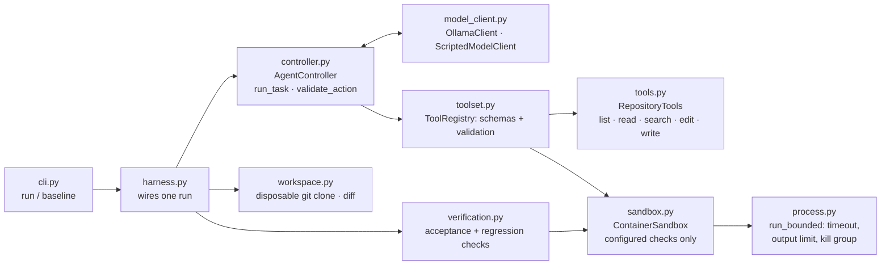
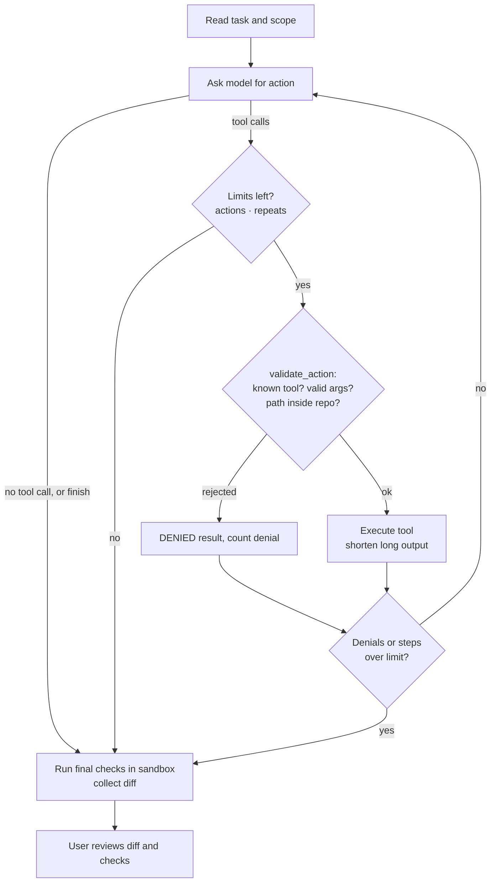

# coding-harness

A small coding harness in Python (Stage 1 of the AAIA semester project). A coding task goes in.
A local model works on a disposable copy of the target repository through validated tools, and
the harness then runs the final checks itself. The user reviews the diff and the check results.

## Setup

Requirements: macOS or Linux, [uv](https://docs.astral.sh/uv/), [Ollama](https://ollama.com),
Podman (or Docker, via `engine = "docker"`), git.

```bash
uv sync                                   # Python 3.13 and dependencies
ollama pull qwen3.8:27b                   # the model in harness.example.toml
git clone https://github.com/cosmicpython/code code && git -C code checkout 14c84797ffa77255d53cf1a02fe6aafda2b68aeb
podman build -f sandbox/cosmic-python.Containerfile -t harness-cosmic-python code
cp harness.example.toml harness.toml      # no secrets needed
```

## Usage

```bash
uv run coding-harness baseline                    # final checks on the untouched starting commit
uv run coding-harness run --task "Fix ..."        # or --task-file task.md; --model to override
uv run pytest                                     # harness tests: no model, no container needed
```

`run` prints each model step and tool request, then the changed files, the diff and a table
of final checks. It exits with 0 only if an acceptance check is configured and every final check passed. Each run keeps its repository
copy and a full `trace.json` (messages, events, commands, exit codes, diff) under `.harness/runs/`.

## Components



| Module | Responsibility |
|---|---|
| `controller.py` | Loop: ask the model → validate → execute → return the result. Enforces step, action, denial, repeat and retry limits. |
| `toolset.py` | Tool descriptions and Pydantic argument schemas. Rejects unknown tools and invalid arguments before execution. |
| `tools.py` | File tools confined to the repository copy (resolves symlinks, blocks `..`, absolute paths and `.git`). |
| `sandbox.py` / `process.py` | Runs configured commands in a container. Timeout, bounded output, and removal of the process group and container. |
| `workspace.py` | Fresh clone at the configured commit with no remote. Diff and changed files. |
| `verification.py` | Final checks, run whatever the model claims. Failed or unavailable checks stay visible. |
| `model_client.py` | Provider-neutral `ModelClient` protocol. Ollama client with a fallback for tool calls written as text. |

## Agent loop



## Safety measures

- **Disposable copy.** Each run clones the target into `.harness/runs/<id>/repo` and removes the
  `origin` remote. The harness has no push, merge or deploy tool. Git runs with hooks and
  fsmonitor disabled.
- **Scoped file tools.** Paths are resolved (including symlinks) and must stay inside the copy.
  `.git` is off limits and writes are size-limited.
- **Contained execution.** The model can only run named checks from `[checks]`, never a free
  shell command. Each check runs in a new container with no network, all capabilities dropped,
  `no-new-privileges`, memory, CPU and PID limits, a read-only root filesystem, and the
  repository copy mounted read-only. No home directory or credentials are mounted.
- **Stoppable.** Commands run in their own process group. On timeout or Ctrl+C the group is
  killed and the container is removed with `podman rm --force`.
- **Hidden acceptance check.** `acceptance/` is outside the agent's copy and is mounted read-only
  only for the final verification.
- **Untrusted input.** Model replies, file contents and command output are treated as data. Every
  tool request is validated in application code.

## Tests

Core tests use scripted model replies and a fake execution environment, so no model, API key or
container is needed.

| Handout requirement | Tests |
|---|---|
| File tools | `tests/test_file_tools.py` |
| Controller | `tests/test_controller.py` |
| Invalid request | `tests/test_invalid_requests.py` |
| Failed command | `tests/test_process.py`, `tests/test_verification.py` |
| Action limit | `tests/test_limits.py::test_repeating_reply_reaches_action_limit` |
| Output limit | `tests/test_limits.py`, `tests/test_process.py` |
| Stoppable command | `tests/test_process.py::test_timeout_kills_the_whole_process_group`, `tests/test_sandbox.py` |
| Bug fix | `acceptance/test_invalid_quantity.py` (final verification, against the real target) |

## Stage 1 task

- **Target:** [cosmicpython/code](https://github.com/cosmicpython/code) at commit `14c84797ffa77255d53cf1a02fe6aafda2b68aeb`
- **Bug:** allocating an order line with a quantity of zero or less is accepted. A negative
  quantity even *increases* the batch's available stock (10 → 15 for −5) and publishes an
  `Allocated` event. The path runs `commands.Allocate` → message bus → `handlers.allocate` →
  `model.Product` / `model.Batch`.
- **Task:** [`tasks/invalid-quantity.md`](tasks/invalid-quantity.md). The task names the
  exception `handlers.InvalidQuantity`, because the acceptance check depends on that interface.
- **Allowed scope:** `service_layer/handlers.py` and, if needed, `domain/model.py`. Existing tests
  must not change.
- **Acceptance check:** [`acceptance/test_invalid_quantity.py`](acceptance/test_invalid_quantity.py).
  On the starting commit, `baseline` reports 2 failed and 1 passed. A reference fix (checked in a
  throwaway copy, not in the repository) gives 3 passed, and the 20 existing unit tests still pass.
- **Manual help during the agent run:** none. Run `20260927-214256` with qwen3.8:27b: 5 model calls, 7 actions, 0 denied, VERIFIED.

```bash
uv run coding-harness baseline                                  # acceptance check fails
uv run coding-harness run --task-file tasks/invalid-quantity.md # agent fixes it; checks pass
```
